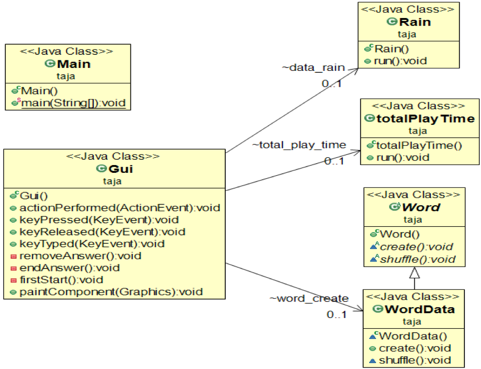

# 자바 산성비 게임

- 2017년 학교 JAVA 수업 내에 프로젝트 과제로 진행한, 산성비 타이핑 게임입니다.
- 한컴타자연습의 '산성비'를 모티브로 하였으며, 총 3개의 난이도로 진행되고, 3개의 하트가 없어지거나, 주어진 모든 단어를 타이핑 했을 때, 게임이 종료 됩니다.
- 게임 종료 시 명중률, 총 플레이 타임을 보여줍니다.
- 단어는 word.txt파일을 통해 추가 가능합니다.

#### **Class Diagram**

